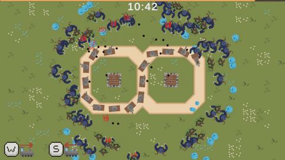

# Portfolio

## Commercial Projects
<table>
  <tr>
    <td width="300"></td>
    <td>
      <h3>Astro Hunters (2024)</h3>
      <h5>Wenkly Studio</h5>
      Astro Hunters VR is a PvPvE extraction shooter set in space. 
      Immerse yourself in the exploration of a unique planet, fight with different enemies, craft, gather resources, and upgrade your weapons. But remember, there are also other hunters on the planet. Will you ally, fight, or betray - it's up to you!
        
      
      
      </td>
  </tr>
  <tr>
    <td width="300"></td>
    <td>
      <h3>Survival Nation (2023)</h3>
      <h5>Wenkly Studio</h5>
      Survival Nation is an open-world online RPG VR game. The player takes on the role of one of the survivors of the zombie apocalypse. The main goal is to survive, but in order to do so, he has to cooperate with other members of the survival camp.
        
      
      
      </td>
  </tr>
  <tr>
    <td width="300"></td>
    <td>
      <h3>Elven Assassin - Rise of Darkness (2023)</h3>
      <h5>Wenkly Studio</h5>
      Rise of Darkness is an expansion for Elven Assassin. It expands the gameplay with three new maps, two sets of equipment, new skills and many new opponents.
        
      
      
      </td>
  </tr>
</table>

## Private Projects
<table>
<tr>
    <td width="300"></td>
    <td>
      <h3>Loop Train (2025)</h3>
      Game created for GMTK game jam. Defend your base against endless waves of enemies by developing your looped train.
        
      
      
      </td>
  </tr>
  <tr>
    <td width="300"></td>
    <td>
      <h3>Snowball Fighter (2025)</h3>
      Dive into a winter wonderland and battle online to prove who’s the ultimate snowball fight champion.
        
      
      </td>
  </tr>
</table>