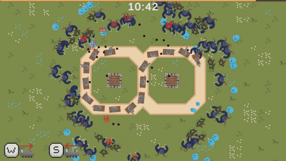
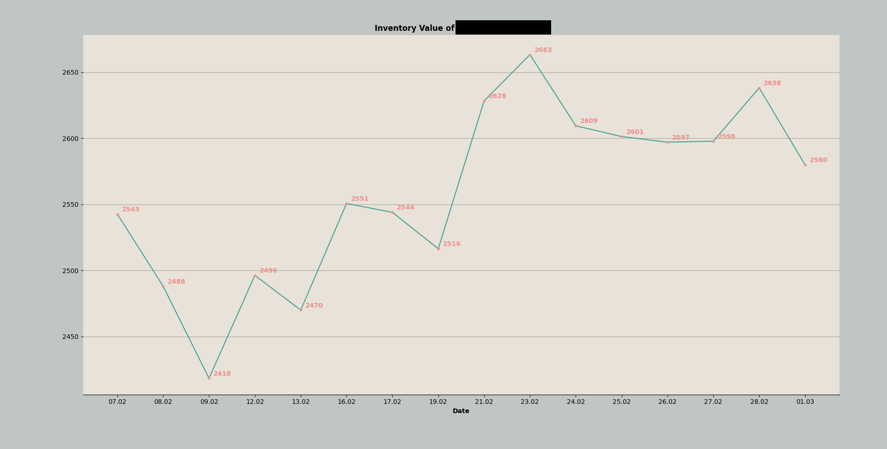

# Portfolio

## Commercial Projects
<table>
  <tr>
    <td width="300"></td>
    <td>
      <h3>Astro Hunters (2024)</h3>
      <h5>Wenkly Studio</h5>
      Astro Hunters VR is a PvPvE extraction shooter set in space. 
      Immerse yourself in the exploration of a unique planet, fight with different enemies, craft, gather resources, and upgrade your weapons. But remember, there are also other hunters on the planet. Will you ally, fight, or betray - it's up to you!
       
      <h4>I was responisble for:</h4>
      1. Weapon atachment system 
      2. Weapon elemental system included stats value randomization, fuel system and effects 
      3. Crafting stations 
      4. Game optymalization 
      5. Various UI elements (crafting stations, descriptions of items on the map, etc) 
      6. Developing opponents AI systems 
      7. Pre-order rewards 
      8. Debugging 
        
      
      
      </td>
  </tr>
  <tr>
    <td width="300"></td>
    <td>
      <h3>Survival Nation (2023)</h3>
      <h5>Wenkly Studio</h5>
      Survival Nation is an open-world online RPG VR game. The player takes on the role of one of the survivors of the zombie apocalypse. The main goal is to survive, but in order to do so, he has to cooperate with other members of the survival camp.
       
      <h4>I was responisble for:</h4>
      1. Game optymalization 
      2. Fishing system 
      3. Debugging 
        
      
      
      </td>
  </tr>
  <tr>
    <td width="300"></td>
    <td>
      <h3>Elven Assassin - Rise of Darkness (2023)</h3>
      <h5>Wenkly Studio</h5>
      Rise of Darkness is an DLC for Elven Assassin. It expands the gameplay with three new maps, two sets of equipment, new skills and many new opponents.
       
      <h4>I was responisble for:</h4>
      1. Content management system with external systems integration. 
      2. New spells implementation 
      3. New gear implementation 
      4. Adapting the UI to additional content 
      5. Creating external tools for the team 
        
      
      
      </td>
  </tr>
</table>

## Private Projects
<table>
<tr>
    <td width="300"></td>
    <td>
      <h3>Loop Train (2025)</h3>
      Game created for GMTK game jam. Defend your base against endless waves of enemies by developing your looped train.
        
      <!--  -->
      
       
      </td>
  </tr>
  <tr>
    <td width="300"></td>
    <td>
      <h3>Snowball Fighter (2025)</h3>
      Dive into a winter wonderland and battle online to prove who’s the ultimate snowball fight champion.
        
      Multiplayer was implemented using the host mode provided by Unity Netcode (where one player is also responsible for being the server). Reducing server rental costs.      Synchronization takes place both using NetworkVariables and RPC.  
      A lobby system has also been implemented to make it easier to create sessions or join existing friend sessions by using a simple lobby code system.
        
      
      </td>
  </tr>
  <tr>
    <td width="300"></td>
    <td>
      <h3>Steam inventory value calculator (2026)</h3>
      Automating the process of calculating the value of steam equipment. Creating a graph of the change in equipment value over time 
       
      The program was written in Python and uses: 
      1. Steam API 
      2. urllib to retrieve data from the API, and manage errors if necessary 
      3. json to decode api result and store items value 
      4. matplotlib to create a plot from the collected data 
      5. the application also stores item values ​​for a given day, so as not to exceed the daily limit of requests to the Steam API 
              
      
      </td>
  </tr>
</table>